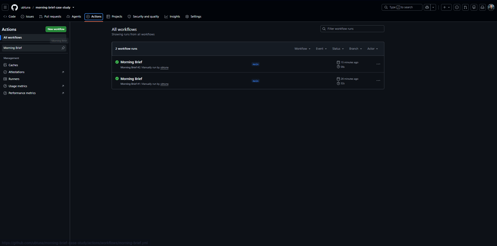
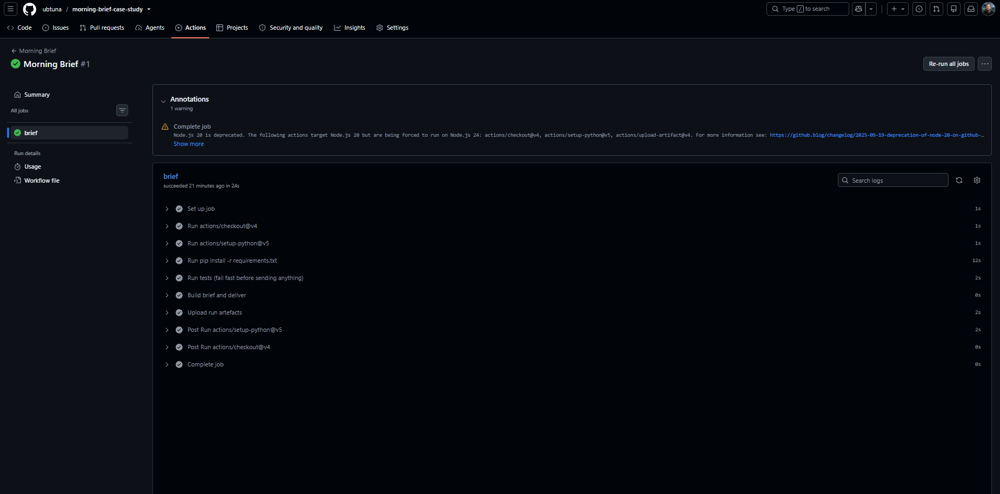
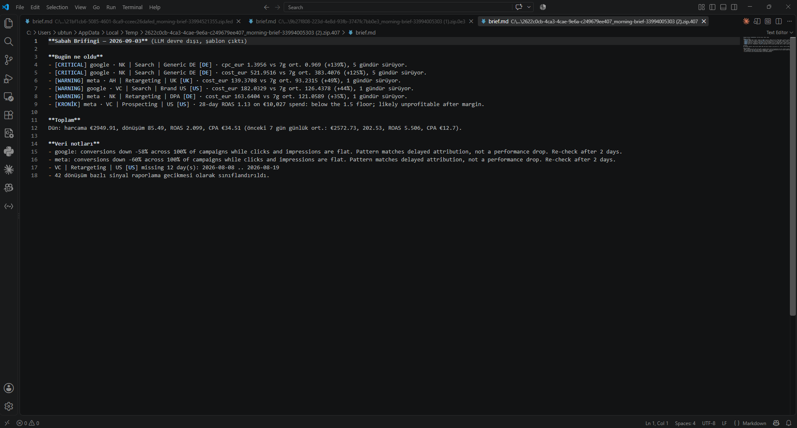
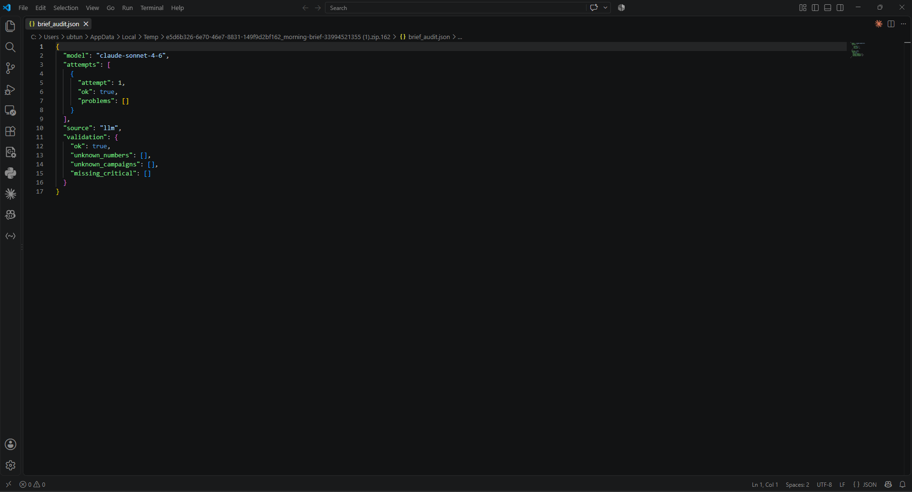

# Otomasyon katmanı — GitHub Actions

Workflow dosyası: `.github/workflows/morning-brief.yml`

## Neden GitHub Actions?

Kod zaten GitHub'da; ayrı bir n8n/Make hesabı, sunucu ya da webhook köprüsü
gerekmiyor. Cron, secret yönetimi, log, artefakt saklama ve manuel tetikleme
hepsi tek dosyada. Test adımı gönderimden önce koşuyor: veri ya da kod
bozuksa Slack'e hiçbir şey gitmiyor.

## Adımlar ve işlevleri

| # | Adım | Ne yapar |
|---|------|----------|
| 1 | `schedule: 0 5 * * *` | Her gün 05:00 UTC = 08:00 İstanbul (Türkiye'de yaz saati yok, sabit). |
| 2 | `workflow_dispatch` | Manuel tetikleme; `report_date` ile geçmiş bir gün yeniden üretilebilir, `no_llm` ile şablon çıktı test edilir. |
| 3 | `concurrency` | Aynı anda iki brifing koşmasını engeller. |
| 4 | checkout + setup-python + pip | Ortamı kurar (`requirements.txt`). |
| 5 | `pytest` | 14 birim testi. Başarısızsa iş burada durur, gönderim yapılmaz. |
| 6 | `python src/run.py` | Normalize → anomali → LLM brifing → denetim → Slack + e-posta. Secret'lar `env` ile geçer; hiçbiri log'a düşmez. |
| 7 | upload-artifact | `brief.md`, `brief_audit.json`, `anomalies.json`, `data_quality.json` 30 gün saklanır; sorun olursa geriye dönük inceleme için. |

## Gerekli secret'lar (Settings → Secrets → Actions)

| Secret | Zorunlu | Açıklama |
|--------|---------|----------|
| `ANTHROPIC_API_KEY` | LLM için | Yoksa pipeline şablon brifing üretir, durmaz. |
| `SLACK_WEBHOOK_URL` | Slack için | Incoming webhook. |
| `SMTP_HOST/PORT/USER/PASSWORD`, `EMAIL_FROM`, `EMAIL_TO` | E-posta için | Herhangi bir SMTP (Gmail app password, SES, vb.). |

Hiçbir kanal tanımlı değilse `run.py` çıktıyı dosyaya yazar ve 0 ile çıkar.
Kanal tanımlı olup gönderim başarısız olursa exit code 2 → Actions kırmızı
görünür, ekip fark eder.

## Hata yönetimi

- Veri dosyası eksik/şeması bozuk → `SchemaError`, exit 1, artefakt yine yüklenir.
- LLM erişilemez ya da denetimden geçemez → 1 retry, sonra şablon brifing; gönderim yine yapılır.
- Slack düşerse e-posta, e-posta düşerse Slack bağımsız olarak denenir.

## Kapsam dışı (süre kısıtı)

- API'den canlı veri çekme adımı (CSV repo'da). Eklenecek yer: "Build brief" adımından önce tek bir `python src/fetch.py`.
- Slack Block Kit ile zengin formatlama; şu an mrkdwn düz metin.

## Çalıştırma kanıtı

İki manuel çalıştırma, ikisi de başarılı. #1 `no_llm` ile şablon brifing, #2 `ANTHROPIC_API_KEY` secret'ı eklendikten sonra gerçek LLM brifingi.

Adım sırası: testler gönderimden önce koşuyor. Node 20 uyarısı GitHub'ın action sürümleriyle ilgili, pipeline'ı etkilemiyor.

#1 artefaktı: LLM devre dışıyken üretilen şablon brifing (fallback yolu).

#2 artefaktı, `brief_audit.json`: model `claude-sonnet-4-6`, ilk denemede grounding denetimi geçti (bilinmeyen sayı, bilinmeyen kampanya ve atlanmış kritik bulgu: sıfır).
